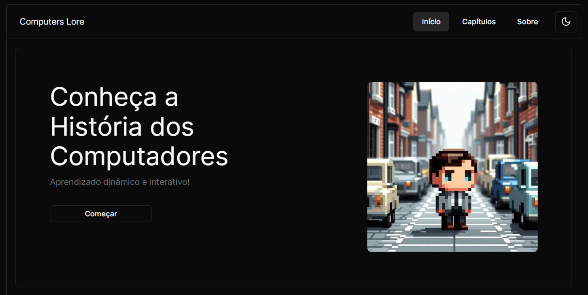

# Computers Lore

> Plataforma de aprendizado sobre a História dos Computadores.

### Metas e Objetivos

-   [x] Timelines;
-   [x] Lista dos Principais;
-   [ ] Blogposts;
-   [ ] Quiz.

### Linguagens e Tecnologias

### Desenvolvedores

<table>
  <tr>
    <td align="center">
      <a href="https://github.com/romhenri">
         
        
          <b>Rômulo Henri</b>
        
      </a>
    </td>
    <td align="center">
      <a href="https://github.com/NandoTavares">
         
        
          <b>Ernandes Tavares</b>
        
      </a>
    </td>
    <td align="center">
      <a href="https://github.com/EduTavares1">
         
        
          <b>Eduardo Tavares</b>
        
      </a>
    </td>
    <td align="center">
      <a href="https://github.com/LULthor">
         
        
          <b>Lucas Rodrigo</b>
        
      </a>
    </td>
  </tr>
</table>

 
